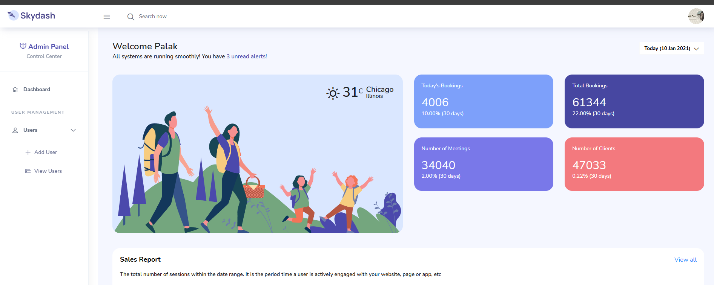
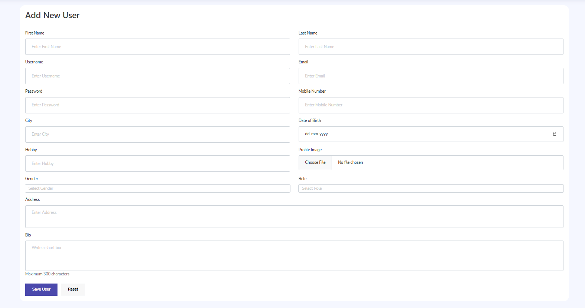
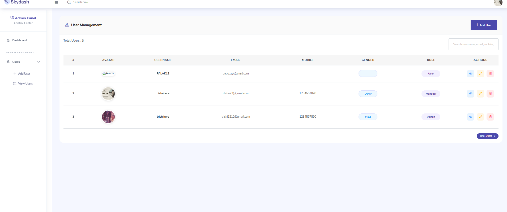
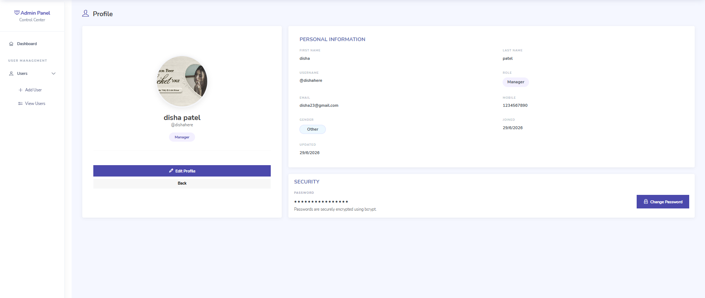

# User Management System

A full-stack User Management System built with **Node.js**, **Express.js**, **MongoDB**, **Passport.js**, and **Express Session**. The project demonstrates secure authentication, session management, complete CRUD operations, file uploads, and profile management using the MVC architecture.

---

## Overview

This project allows administrators to securely manage user accounts through an intuitive dashboard. Authentication is handled using Passport.js with Express Session, while passwords are encrypted using Bcrypt before being stored in MongoDB.

---

## Key Features

### Authentication
- Register Account
- Login using Passport.js
- Session-based Authentication
- Logout
- Forgot Password
- Change Password
- Protected Routes
- Flash Messages

### User Management
- Create User
- View Users
- View User Details
- Edit User
- Delete User

### Profile
- Upload Profile Image
- View Profile
- Edit Profile
- Update Password

---

## Tech Stack

| Category | Technology |
|----------|------------|
| Backend | Node.js |
| Framework | Express.js |
| Database | MongoDB |
| ODM | Mongoose |
| Authentication | Passport.js |
| Session | Express Session |
| Template Engine | EJS |
| Styling | Bootstrap 5 |
| Password Hashing | Bcrypt |
| File Upload | Multer |

---

## Application Workflow

```


Register User
      │
      ▼
Hash Password
      │
      ▼
Store User
      │
      ▼
Login
      │
      ▼
Passport Authentication
      │
      ▼
Session Created
      │
      ▼
Access Protected Routes
      │
      ▼
Perform CRUD Operations
      │
      ▼
Logout


```

---

## Project Structure

```


config/
controllers/
middleware/
model/
public/
routes/
views/
app.js
package.json
README.md


```

---


## Screenshots

> Add screenshots of:


- Login Page


- Dashboard



- Add User




- View Users




- User Profile




- Edit User


- Sidebar


---

## Demo Video

Video Link:

```


Update after recording.


```

---


## Installation

Clone the repository.

```bash
git clone https://github.com/your-username/user-management-system.git
```

Install dependencies.

```bash
npm install
```

Run the project.

```bash
npm start
```

Open your browser.

```
http://localhost:8000
```

---

## Project Highlights

- MVC Architecture
- Passport.js Authentication
- Express Session
- CRUD Operations
- File Upload using Multer
- Password Encryption with Bcrypt
- Flash Messages
- Protected Routes
- Responsive Admin Dashboard

---

## Project Updates

This section records the major improvements made throughout the development of the project.

| Version | Description |
|----------|-------------|
| v1.0 | Initial project setup and MVC structure |
| v1.1 | Authentication using Cookies |
| v1.2 | Complete CRUD operations |
| v1.3 | Avatar Upload & Profile Page |
| v1.4 | Form Validation & Flash Messages |
| v2.0 | Passport.js + Express Session Authentication |
| v2.1 | Profile Dropdown & Change Password |

---

## Author

Developed as a learning project to practice:

- Express.js
- MongoDB & Mongoose
- Passport.js
- Express Session
- MVC Architecture
- CRUD Operations
- Authentication & Authorization